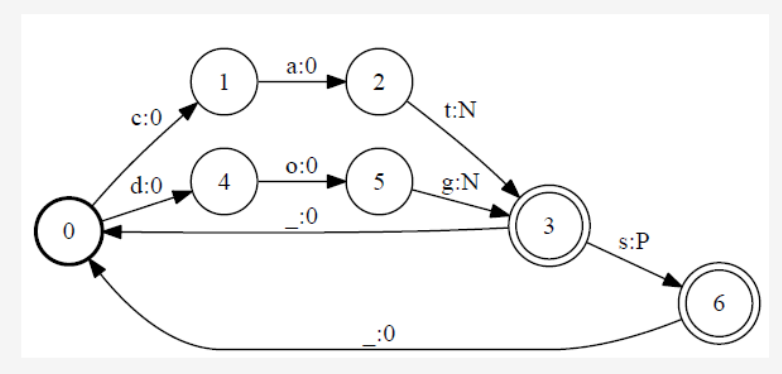

# Background

## Linguistic Knowledge

* **Constituents**: `Constituent` - it is a unit of the syntax of a sentence that has a specific whole. Ex: below
    * __Children__ eat pizza or __They__ eat pizza. The underline fragment indicates the subject of the sentence, those can be replaced with each other the sentence would still be grammatical. Another Ex below.
    * __My cousin's neighbors children__ eat pizza. Here also the underline is subject of the sentence, they have something in common, here it is they are all `noun phrases`, and the length actually doesn't matter. Another Ex:
    * Eat Pizza! - Here the subject is not specified(imperative), but the way the sentence is been said, here it is `You` are the implicit subject.
* **Collocations**: collocations are groups of words that appear more frequently together than you would expect by chance and typically have some specific meaning. Ex: Below
    * Strong beer but *powerful beer - we can say that some beer is strong but we cannot say that that beer is powerful so two synonyms cannot be always interchangeable.
    * Big sister but *large sister - you can say that this is my big sister, but you cannot say this my large sister, even though big and large are synonyms.
* **How to get this knowledge in the system**: 
    * Manual rules - Ex: `big sister` means this and `large sister` means completely different, and encode those rules by hand in the system. Or
    * Automatically acquired from large text collections (corpora)
* **Knowledge about language**:
    * Phonetics and phonology - the study of sounds - example what are consonants and vowels and which consonants are stops versus fricatives
    * Morphology - the study of word components - example in the word `impossible`, `im` is a prefix that means negation and impossible means something that is not possible.
    * Syntax - the study of sentence and phrase structure - what is the `subject` of the sentence, what is the `object`, what is the `verb`
    * Lexical semantics - the study of the meanings of individual words.
    * Compositional semantics - how to combine words and segments of sentences and to understand the meaning of the combined sentence.
    * Pragmatics - how to accomplish goals
    * Discourse conventions - how to deal with units larger than utterances - Ex: you can have a multi sentential paragraph where each additional sentence somehow referes to first sentence by using pronouns and other forms of reference.

## Computer Science - Finite-state Automata

Finite-state Automata is a machine that consists of states and transitions one of the states is the start state and we can also have one or more final or accept states. See pic below.

Here state zero is the start state it's indicated by a solid circle the solid line circle and state number thirteen is an accept state and that is denoted by the doublecircle the transitions go as follows state zero to state one you have the letter C from state 1 to state 2 you have the letter A from state 2 to state 2 you have the letter T then there is a space from 3 to 4 and so on so the whole automaton here is used to encode the sequence of three words cat space cats space dogs.

Another automaton known as transducer can be then combined with the previous automaton to perform some sort of phonological or morphological analysis of the sentence, see pic below.

[YouTube Video](https://www.youtube.com/watch?v=0X-n4Z1U9wI)

Next [Linguistics](01_07_Linguistics.md)
